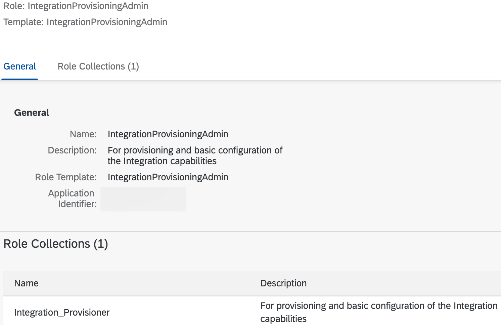

# Subscribe to SAP Integration Suite
* Subscribe to SAP Integration Suite by following these [SAP Help Portal instructions](https://help.sap.com/docs/SAP_CLOUD_PLATFORM_INTEGRATION_SUITE/51ab953548be4459bfe8539ecaeee98d/8a3c8b7a6b1c4f249bb81d11644ef806.html) in your BTP subaccount.

* You can utilize a [free tier service plan](https://help.sap.com/docs/SAP_CLOUD_PLATFORM_INTEGRATION_SUITE/51ab953548be4459bfe8539ecaeee98d/ddf66923270b4078ac6b88026553d068.html) to run this use case end to end.

* Important: Before accessing the application, be sure to assign the Integration_Provisioner role collection to your user account.
    
