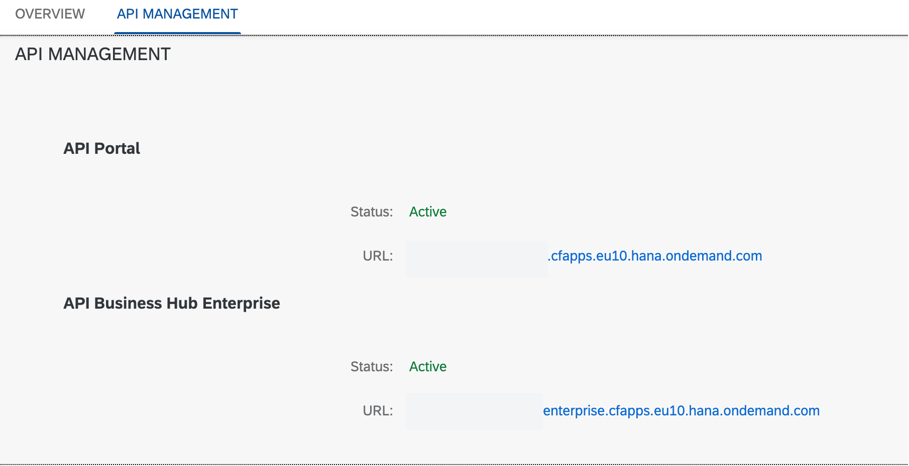

# Activate the API Management capability in SAP Integration Suite

- Access the SAP Integration Suite link from your BTP subaccount under instances and subscriptions
- Select **Add Capabilities**
- Check the **Design, Develop and Manage APIs** option and click Next
- Check the **Enable API Business Hub Enterprise** option and click Next
- Click **Activate** to initiate the process

Activation can take a few minutes, so wait until the status is marked Active before proceeding. Make note of the API Portal and Business Hub Enterprise URL for reference.

You can refer to the [help documentation](https://help.sap.com/docs/SAP_CLOUD_PLATFORM_API_MANAGEMENT/66d066d903c2473f81ec33acfe2ccdb4/f6eb4332cd5144ef91f4a84cc614ba1c.html?locale=en-US) for the complete process.

Once activation is complete, return to the BTP cockpit and assign the **APIManagement.SelfService.Administrator** role collection to your user account. This allows us to access the newly provisioned API Portal with full control.

# Configure the API Management Service

Now you can select the API Management capability from the Integration Suite home page. Specify Non Production under the account field and enter a virtual host name and notification contact. Leave the default checkbox to make yourself the API Portal administrator. Confirm the settings.