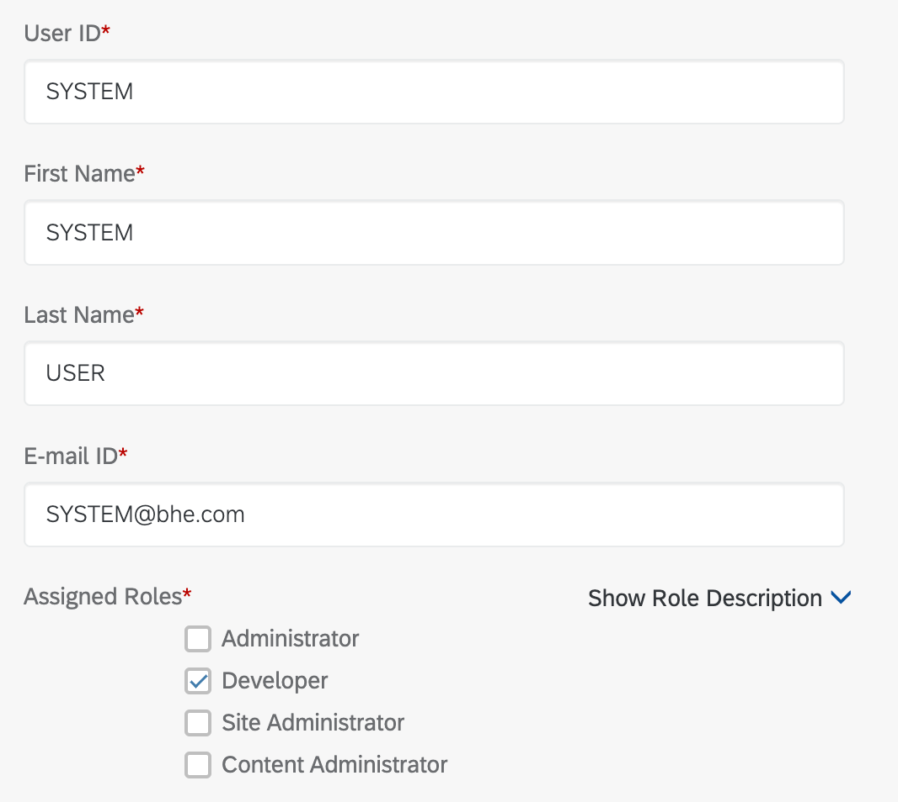
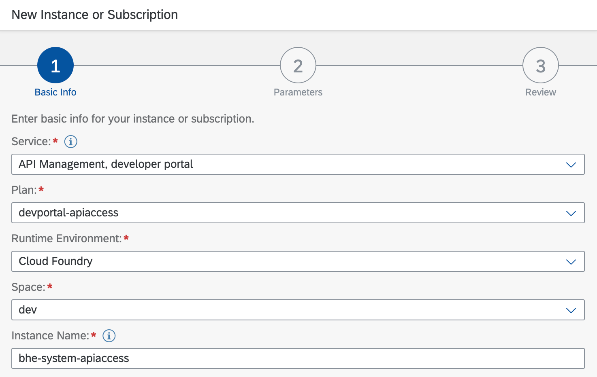
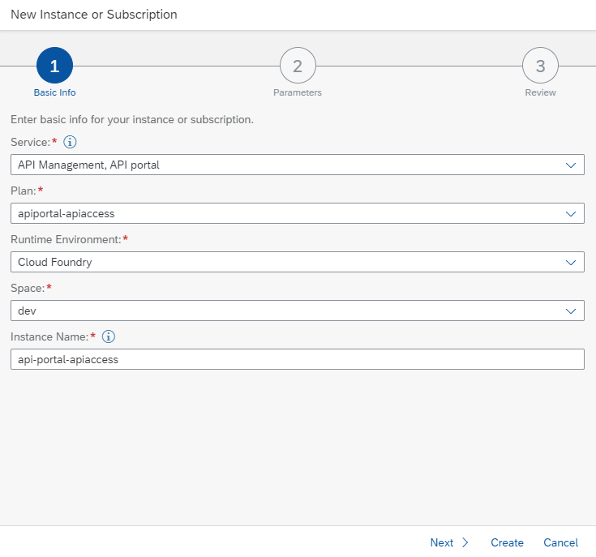
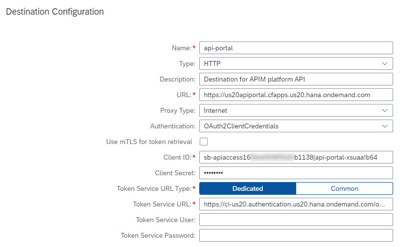

# Enable access to Integration Suite platform API
The following steps allow you to create a service account for unregistered users to browse your API catalog. Please make sure the Cloud Foundry environment is enabled in your subaccount to create the service instances. 

## Create a service account for Business Hub Enterprise guest access

  * Assign yourself the **AuthGroup.SelfService.Admin** role
  * Access the Business Hub Enterprise URL and select **Manage**
  * Select **Manage Users** > **Registered Users** and click the plus sign to add a new user
  * Enter details for a generic user account and assign it the **Developer** role
     

## Create a service instance for Developer Portal API access
A service instance lets us build a UI that retrieves data from Business Hub Enterprise as the service account. The details are located in the [SAP API Management help](https://help.sap.com/docs/SAP_CLOUD_PLATFORM_API_MANAGEMENT/66d066d903c2473f81ec33acfe2ccdb4/dabee6e347f645a6805ec5b29f5d578c.html?locale=en-US)

  * Navigate to the subaccount in the BTP cockpit
  * Click **Instances and Subscriptions** and select **Create**
  * Select **API Management, developer portal** from the Service list and fill out the remaining fields as below
     
  * On the next tab, add the JSON parameters to provide access as the system user, providing the user id from the previous step
      ```
      {
      "role": "AuthGroup.API.ApplicationDeveloper",
      "developerId": "SYSTEM"
      }
      ```
  * Complete the process and confirm the successful creation of the service instance
  * Locate the service instance and create a service key. Make note of the JSON values which will look something like this
      ```
      {
      "url": "https://devportal.cfapps.hana.ondemand.com",
      "tokenUrl": "https://tenant.authentication.hana.ondemand.com/oauth/token",
      "developerId": "SYSTEM",
      "clientId": "sb-devportal-apiaccess|dev-portal-xsuaa",
      "clientSecret": "secret"
      }
      ```
  * Create a service instance of SAP Process Automation along with a service key. Note the URL and credentials.

## Create a service instance for API Portal API access
A service instance lets us interact with the API Management, API portal service to retreive bills for the invoicing scope of the mission. The details are located in the [SAP API Management help](https://help.sap.com/docs/SAP_CLOUD_PLATFORM_API_MANAGEMENT/66d066d903c2473f81ec33acfe2ccdb4/e0646630540d440aa1177b389f512afa.html?locale=en-US)

  * Navigate to the subaccount in the BTP cockpit
  * Click **Instances and Subscriptions** and select **Create**
  * Select **API Management, API portal** from the Service list and fill out the remaining fields as below
     
  * If the service is not available in the Service list, please assign it to your subaccount from your global account
  * On the next tab, add the JSON parameters to provide administrator access using this service instance
      ```
      {
          "role": "APIPortal.Administrator"
      }
      ```
  * Complete the process and confirm the successful creation of the service instance
  * Locate the service instance and create a service key. Make note of the JSON values which will look something like this
      ```
      {
      "url": "https://apiportal.cfapps.hana.ondemand.com",
      "tokenUrl": "https://tenant.authentication.hana.ondemand.com/oauth/token",
      "clientId": "sb-apiaccess|api-portal-xsuaa",
      "clientSecret": "secret"
      }
      ```
## Create a destination for API Portal API access
A new destination using the **API Portal API access** service key details can be used by Kyma to retreive billing information from API Portal for the invoicing scope of the mission.

  * Navigate to the subaccount in the BTP cockpit
  * Click **Destinations** and create a new destination called **api-portal**
  * Provide the details of your API Portal API access service key which will look something like this
    - Description=Destination for APIM platform API
    - Type=HTTP
    - name=api-portal
    - clientId=sb-apiaccess|api-portal-xsuaa
    - clientSecret=secret
    - Authentication=OAuth2ClientCredentials
    - tokenServiceURL=https://tenant.authentication.hana.ondemand.com/oauth/token
    - ProxyType=Internet
    - URL=https://apiportal.cfapps.hana.ondemand.com
    - tokenServiceURLType=Dedicated
  * A sample destination looks like this
    
