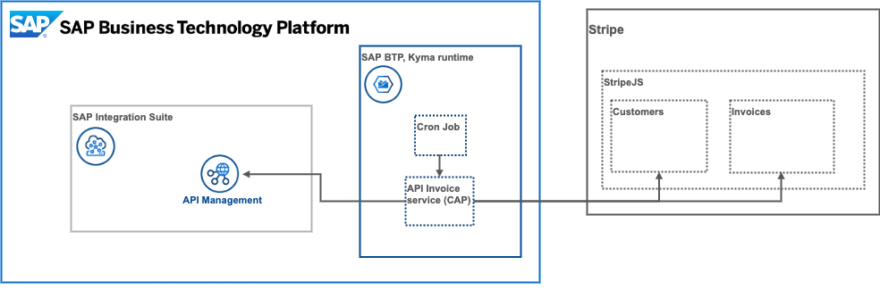
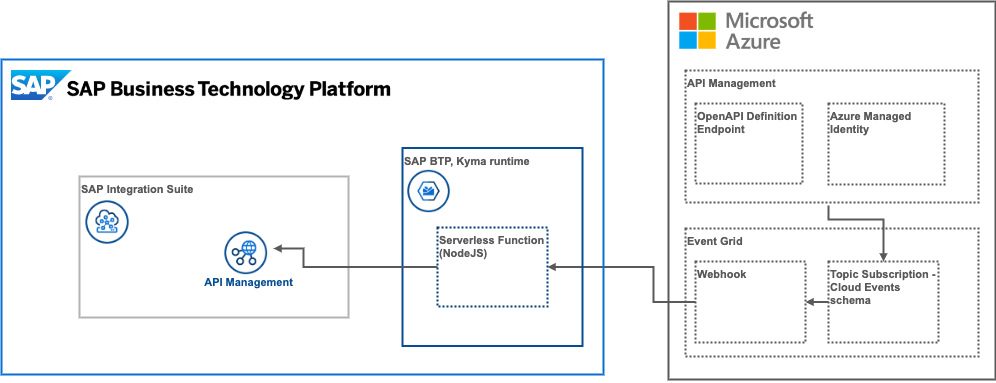

# Getting started with the use case

## Setup phase
All SAP BTP services in this use case have free tier service plans. Remember to select these service plans when activating subscriptions in your subaccount to prevent unexpected charges. [Discover other free services](https://help.sap.com/docs/BTP/65de2977205c403bbc107264b8eccf4b/524e1081d8dc4b0f9d055a6bec383ec3.html) on the [SAP Discovery Center](https://discovery-center.cloud.sap/#/viewServices?provider=all&regions=all&category=freetierservices).

* [Setup SAP low code solutions using BTP boosters](https://github.com/SAP-docs/btp-cloud-platform/blob/main/docs/30-development/boosters-fb1b561.md) - In this section, see how to use BTP boosters and then automate the setup of SAP BTP low code SaaS applications
* [Subscribe to SAP Integration Suite](./01-02-Subscribe-Integration-Suite.md)
* [Deploy SAP BTP, Kyma runtime](https://github.com/SAP-docs/btp-cloud-platform/blob/main/docs/50-administration-and-ops/create-the-kyma-environment-instance-09dd313.md) - If you're interested in API federation and monetization, you will need an instance of Kyma runtime. Follow these instructions to get started with Kyma.
* [Activate the API Management capability in SAP Integration Suite](01-04-Activate-API-Management.md)
* [Create service instances for API access](01-05-Create-service-instances.md) 

## Onboarding for Stripe
As part of the mission scope, you can deploy an API billing service that utilizes [Stripe](https://stripe.com) invoicing. The following resources help you create a Stripe developer account and get you started with their Node.js SDK.
  * Register a free [Stripe developer](https://dashboard.stripe.com/register) account
  * Get started with the [Stripe Node.js SDK](https://stripe.com/docs/development/quickstart/node)

  

## Pre-requisites for API Gateway federation (Future scope item)
This part of the use case scope demonstrates federation of API from different gateway providers. The sample provided here shows how to integrate Microsoft Azure API Management with SAP Integration Suite, but it can be applied to any 3rd party API gateway that supports eventing with the [CloudEvents](https://cloudevents.io/) standard and can provide an OpenAPI specification for it's resources.
  * Get an instance of [Azure API Management](https://docs.microsoft.com/en-us/azure/api-management/get-started-create-service-instance)
  * Activate [Azure Event Grid](https://docs.microsoft.com/en-us/azure/event-grid/)
  * [Send events from API Management to Event Grid](https://docs.microsoft.com/en-us/azure/api-management/how-to-event-grid)
  * Create a [topic using Cloud event schema](https://docs.microsoft.com/en-us/azure/event-grid/event-schema-api-management?tabs=cloud-event-schema) for events such as **Microsoft.ApiManagement.APIUpdated** and **Microsoft.ApiManagement.APICreated**
  * [Dynamically expose Open API definitions in Azure API Management](https://yourazurecoach.com/2021/12/21/dynamically-expose-open-api-definitions-in-azure-api-management/) so that an SAP BTP webhook can callback and retrieve the API specification

  