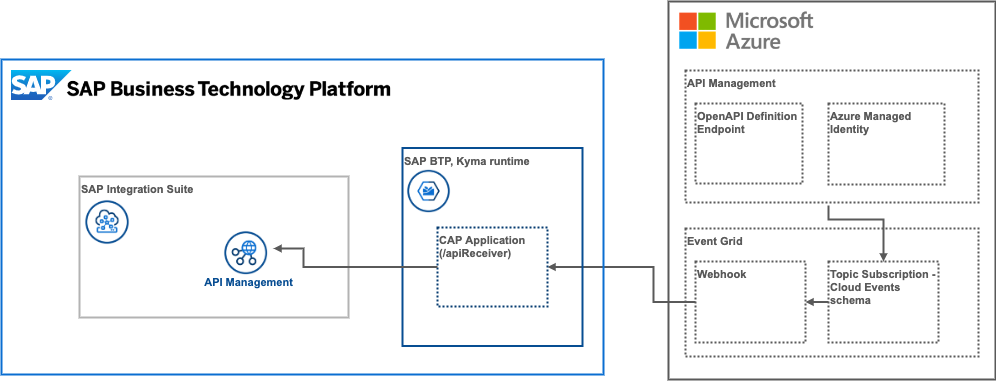

# Getting started with the use case

## Setup phase
All SAP BTP services in this use case have free tier service plans. Please remember to select these service plans when activating a subscriptions in your subaccount to prevent unexpected charges. [Discover other free services](https://help.sap.com/docs/BTP/65de2977205c403bbc107264b8eccf4b/524e1081d8dc4b0f9d055a6bec383ec3.html) on the [SAP Discovery Center](https://discovery-center.cloud.sap/#/viewServices?provider=all&regions=all&category=freetierservices).

## Prerequisites
The required systems and components are:

- SAP BTP account

Entitlements/Quota required in your SAP Business Technology Platform Account:

| Service                           | Plan        | Number of instances |
| --------------------------------- | ----------- | ------------------- |
| SAP Integration Suite             | free        | 1                   |
|API Management, API Portal         | apiportal-apiaccess | 1           |
|API Management, developer portal   | devportal-apiaccess | 1           |
| SAP Process Automation            | standard    | 1                   |
| Authorization & Trust Management  | application | 1                   |
| Destination                       | lite        | 1                   |
| SAP AppGyver                      | free        | 1                   |
| SAP BTP, Kyma runtime             | free        | 1                   |

Subscriptions required in your SAP Business Technology Platform Account:

| Subscription                      | Plan             |
| --------------------------------- | ---------------- |
| SAP Integration Suite             | standard         |
| SAP AppGyver                      | standard         |
| SAP Process Automation            | free             |

* [Setup SAP low code solutions using BTP boosters](https://github.com/SAP-docs/btp-cloud-platform/blob/main/docs/30-development/boosters-fb1b561.md) - In this section, you can learn how to use BTP boosters and automate the setup of SAP BTP low code SaaS applications by executing the SAP Process Automation and SAP AppGyver boosters in your subaccount
* [Subscribe to SAP Integration Suite](./01-02-Subscribe-Integration-Suite.md)
* [Deploy SAP BTP, Kyma runtime](https://github.com/SAP-docs/btp-cloud-platform/blob/main/docs/50-administration-and-ops/create-the-kyma-environment-instance-09dd313.md) - If you're interested in API federation and monetization, you will need an instance of Kyma runtime. Follow these instructions to get started with Kyma.
* [Activate the API Management capability in SAP Integration Suite](01-04-Activate-API-Management.md)
* [Create service instances for API access](01-05-Create-service-instances.md) 

## Prerequisites for for Stripe
As part of the mission scope, you can deploy an API billing service that utilizes [Stripe](https://stripe.com) invoicing. The following resources will help you create a Stripe developer account and get you started with their Node.js SDK.
  * Register a free [Stripe developer](https://dashboard.stripe.com/register) account.
  * Get started with the [Stripe Node.js SDK](https://stripe.com/docs/development/quickstart/node).
  * Setup a Sample API based on the ES5 Demo system (incl. a Rate Plan, API Key verification aso.) as described in the **Develop** scope of the the mission [Get Started with Integration Suite - API Management](https://discovery-center.cloud.sap/missiondetail/3062/3072/). This is an **essential requirement** for the related mission scope. Following the **Getting Started** mission, please create the respective API Product in **API Business Hub Enterprise** and test your application as described. This will create some charges for your Stripe invoices and allows a proper end-to-end test. While doing the Getting Started mission, please consider the following notes:
    - Before deploying your API Proxy, please reload the page to prevent errors.
    - The required policy template in step **Applying Policies** is called **SAP API Management Security Best Practices**. In case the search does not return the correct policy select it manually.
    - Set the correct value for the **Verify API Key** policy. Please use the value in the screenshot which is **request.header.APIKey**.
    - If you face issues with publication of your API Product to API Business Hub Enterprise, please assign the missing **AuthGroup.SelfService.Admin** & **AuthGroup.API.ApplicationDeveloper** role collections to your user and **re-login**.
    - Even if you're signed-in automatically to API Business Hub Enterprise, make sure to **Register** as a **Developer**. **Logout** and **Login** before creating a new **Application** in API Business Hub Enterprise for the first time.
    - Register a new **Application** (like StoreSilver) in API Business Hub Enterprise after you created and assigned the **Rate Plan** to your API Product. Your first application **Store** will not have a Rate Plan assigned. 
    - Your API Portal Bill section should look similar to the following after triggering a first call of your **StoreSilver** application: 

      

  * Here you can see the detailed architecture diagram of the API Monetization with Stripe mission scope. 

  

## Prerequisites for API Gateway federation (Future scope item)
This part of the use case scope demonstrates federation of API from different gateway providers. The sample provided here shows how you can integrate Microsoft Azure API Management with SAP Integration Suite, but it can be applied to any 3rd party API gateway that supports eventing with the [CloudEvents](https://cloudevents.io/) standard and can provide an OpenAPI specification for it's resources.
  * Get an instance of [Azure API Management](https://docs.microsoft.com/en-us/azure/api-management/get-started-create-service-instance)
  * Activate [Azure Event Grid](https://docs.microsoft.com/en-us/azure/event-grid/)
  * [Send events from API Management to Event Grid](https://docs.microsoft.com/en-us/azure/api-management/how-to-event-grid)
  * Create a [topic using Cloud event schema](https://docs.microsoft.com/en-us/azure/event-grid/event-schema-api-management?tabs=cloud-event-schema) for events such as **Microsoft.ApiManagement.APIUpdated** and **Microsoft.ApiManagement.APICreated**
  * [Dynamically expose Open API definitions in Azure API Management](https://yourazurecoach.com/2021/12/21/dynamically-expose-open-api-definitions-in-azure-api-management/) so that an SAP BTP webhook can callback and retrieve the API specification

  
