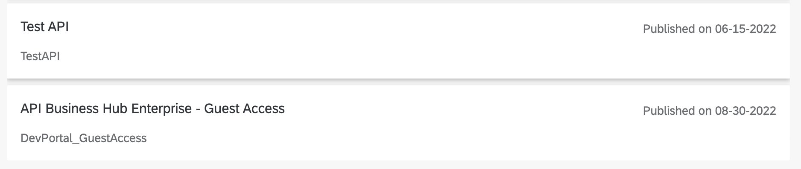
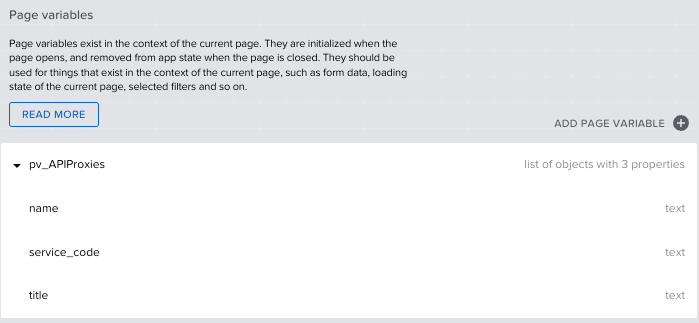
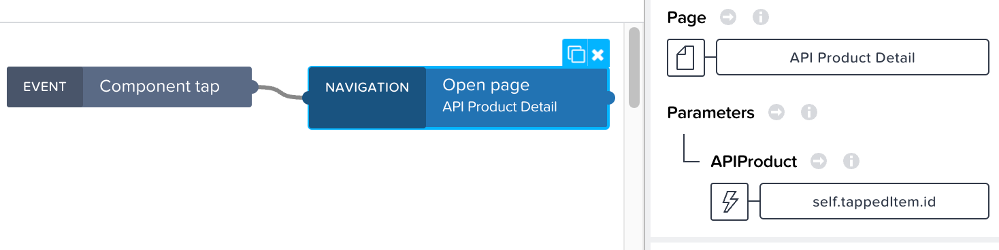
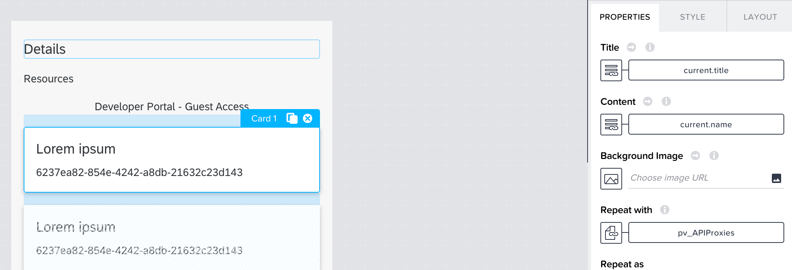
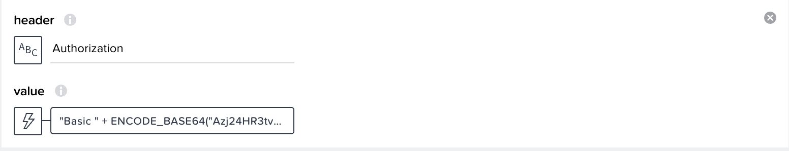
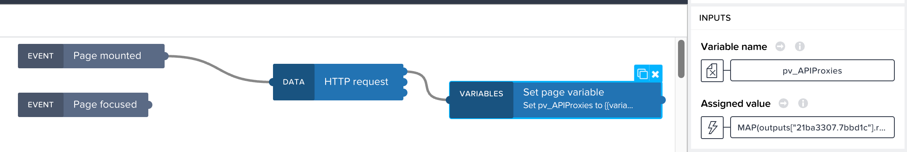
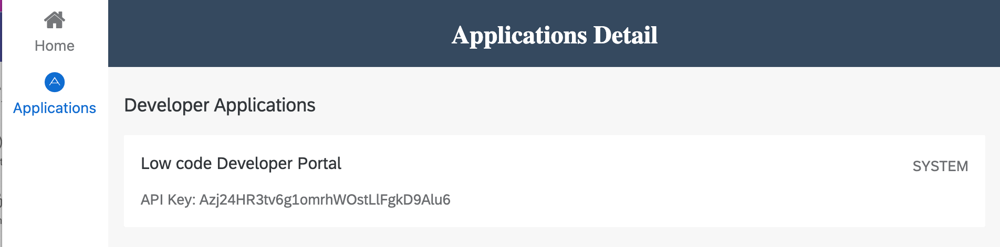
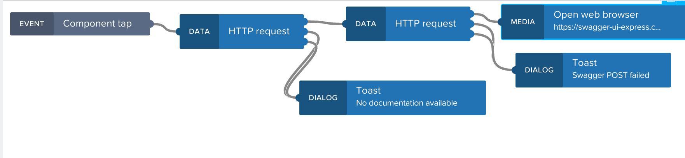

# Build a low code Developer Portal
In this section, you will build a low code app in SAP AppGyver. For reference, see other walkthrough missions, such as [Custom mobile HR app](https://github.com/SAP-samples/successfactors-extension-calculate-employee-seniority/tree/mission-sfsf-mobile-appgyver/04-CreateSAPAppGyverProject) and [Covid certificate checker](https://github.com/SAP-samples/cap-appgyver-covid-certcheck/tree/main/tutorials/4_AppGyverApp).

## API Product Home
1. Access SAP AppGyver from the SAP BTP cockpit under **Subscriptions and Instances** and create a new SAP Appgyver project from the dropdown list.
2. Activate **Auth > Enable Authentication > BTP authentication**.
3. Create a new integration under **Data > Add Integration > BTP Destinations** and select the LCDevPortal destination from the previous step.
4. Enable the Applications, APIProducts, and APIProxies entities and save (use the browse data feature to make sure everything is working).
5. Open the default empty page and rename it to **Home**. 
6. Create two more pages, by selecting **Add new page** from the pages screen, and name them **Applications Detail** and **API Product Detail**.
7. On the **Home** page install the Basic card list component from the marketplace, and add it to the canvas.
8. Select the Basic Card component > Properties > Edit configuration and select the APIProducts data source. 
9. Set content, id, label, and title to the formulas below and save the component.
   * LOOKUP(source.record, "name")
   * LOOKUP(source.record, "name")
   * "Published on " + FORMAT_DATETIME_LOCAL(DATETIME(NUMBER(SUBSTRING(LOOKUP(source.record, "published_at"), 6, 19))), "MM-DD-YYYY")
   * LOOKUP(source.record, "title")
  
10. Preview the home screen from **Launch > Web Apps > Open App Preview Portal** to see the products available in your tenant:
  

## API Product Detail
You will now make some HTTP calls directly to the underlying API gateway using the same credentials. This is done to take advantage of OData navigation capabilities such as $expand.

1. Select the **API Product Detail ** page and create an app variable called **selectedProduct** under **Variables > App Variables** and set the value type to text.
2. Open **API Product Detail** and add a page parameter called **APIProduct** with type text.
3. Create a page variable called **pv_APIProxies** to store information about the proxies inside an API Product. 
4. Set pv_APIProxies to a list and the item type to be an object before adding the named properties **name**, **service_code**, and **title**.

  

5. Return to the home screen and add navigation logic to the component tap event of the basic list. 
6. Bind the page parameter to **APIProduct** and populate with a formula ```self.tappedItem.id```.

  

7. On the **API Product Detail** page, customize the headers and add a centered text field by setting the layout properties **Width and Height** to **Fit content** and the **Position > Align Self > To Center**. Set the value to the APIProduct page parameter.
8. Add a basic card and set Repeat with to be **pv_APIProxies**.
9. Bind the title and content to the title and name fields of the current data item in repeat.

  

10. Add logic to the Page mounted event of the page layout component by expanding the **Add logic to** menu. 
11. Install the **HTTP Request** component from the flow function market.
12. Set the URL to the following formula, updating the virtual-host and datacenter pieces to match your environment:

"https://virtual-host.prod.apimanagement.datacenter.hana.ondemand.com/sapapimanagementguest/odata/1.0/data.svc/APIProducts('"+params.APIProduct+"')?$format=json&$expand=ToAPIProxies,ToAPIResources,ToRatePlans"

12. Under optional inputs, create a header to hold the basic authentication header. You can use a formula to encode the values at runtime:

  

13. Note that the format is a Base64 encoding of  ```API Key:API Secret``` so if your API Key is ABC and the Secret is 123 you would Base64 encode ABC:123 which is QUJDOjEyMw==
14. In this example, the formula would be ```"Basic " + ENCODE_BASE64("ABC:123")```
15. Add a **set page variable** node and connect the first output node from the **HTTP request**. 
16. Select **pv_APIProxies** and set the assigned value to the following formula, which will form an array out of the expanded ToAPIProxies response

  MAP(outputs["HTTP request"].resBodyParsed.d.ToAPIProxies.results, {name: item.name, title: item.title, "service_code": item.service_code})

  

17. Preview the app and test the navigation from an API Product to the Detail page where you see the API Proxies inside a product:

  

## Application Details
Next, you will create another page to display the API Keys for this system user. So far, you have implemented several controls over access to your BTP account, namely:
* A read-only service account onboarded to the Business Hub Enterprise tenant
* A service instance in the context of that user
* An API Proxy, protected by a rather trivial Basic Authentication scheme
* An SAP BTP destination to manage the Basic Authentication credentials
  
However, we are providing the basic authentication credentials for the custom HTTP requests we make from the low code application. Although you can see the authorization header in Chrome developer tools, we can freely distribute this API key to internal users due to the read-only nature of the underlying account. We could further protect the endpoint from denial-of-service attacks and other malicious activity, by applying rate limits to the API proxy or other policies. Complete the [Get Started with Integration Suite - API Management
](https://discovery-center.cloud.sap/missiondetail/3062/3072/) mission to learn about these concepts in detail.

1. Create a new page called **Application Detail**.
2. Customize the title and add a Basic Card list.
3. Edit the configuration and select the Applications integration:
  * Map content to the formula ```"API Key: " + LOOKUP(source.record, "app_key")```
  * Map id to id
  * label to developer_id
  * title to title
4. Enable navigation and configure items for the home and applications pages. 
5. Preview the app check the new page

  

## Swagger UI (Optional)
As an optional step, you can deploy this ["Dockerized" version of swagger-ui-express](https://github.com/SAP-samples/btp-create-api-integrations/tree/low-code-dev-portal/swagger-ui-sample) on Kyma and use it to provide the API documentation from your Business Hub Enterprise tenant. The full experience of Business Hub Enterprise uses [Swagger UI](https://swagger.io/tools/swagger-ui/) which is implemented as a browser-side js/css. SAP AppGyver doesn't currently support inclusion of custom client-side libraries but it is a current [roadmap item](https://discovery-center.cloud.sap/serviceCatalog/sap-appgyver?service_plan=standard&region=europe(frankfurt)&commercialModel=cloud&tab=roadmap). 

Important: The sample isn't intended to be used productively, as you would run into POST body size issues for very lengthy API documentation and each successive POST overwrites the previous documentation. Instead, consider it to be an example of how you can solve problems creatively with low code tools.

See the tutorial: [Develop a Node.js Application in the SAP BTP, Kyma runtime](https://developers.sap.com/mission.cp-kyma-node-js.html). 

1. Access the **API Product Detail** page and add logic to the component tap event of the basic card list.
2. Add an HTTP request with the following properties.
  * URL (formula): "https://virtual-host.prod.apimanagement.datacenter.hana.ondemand.com/sapapimanagementguest/odata/1.0/data.svc/APIProxies('"+repeated.current.name+"')?$expand=ToProxyEndPoints,ToProxyEndPoints/ToAPIResources,ToProxyEndPoints/ToAPIResources/ToAPIResourceDocumentation,ToAPIProducts/ToAPIResources&$format=json"
  * Add the same basic authentication header as you did in the **Application Details** section.
3. Add another HTTP request and connect it to output 1 of the one you just created. 
4. Set the following properties and update the URL to match your environment.
  * URL (text): https://swagger-ui-express.kyma-cluster-info.com/api-spec/
  * Method: POST
  * Request Body (formula): ```{"content":SELECT_BY_KEY(outputs["HTTP request"].resBodyParsed.d.ToProxyEndPoints.results[0].ToAPIResources.results, "resource_path", "/SWAGGER_JSON")[0].ToAPIResourceDocumentation.results[0].content}```
5. Install the **Open web browser** component and attach one to the last POST request. 
6. Set the URL to https://swagger-ui-express.kyma-cluster-info.com/api-docs/
7. Attach **Toast** components to the failure nodes of the HTTP requests with messages like **No documentation available** and **Swagger POST failed**

  
