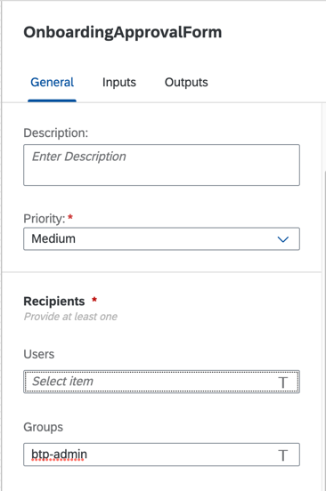

## Create a process to onboard and provision new developers with access
Now that the portal is functional, we can provide an onboarding experience for users who browse the API catalog and want to gain access. With SAP Process Automation, we'll receive an inbound API request from the low-code portal, and initiate an approval request for a portal administrator. Once access is granted, the developer will automatically be registered with the Business Hub Enterprise, assigned roles, and provisioned with an application and API Key. 

1. Create a process and configure API trigger:
  * Import the process from the [provided mtar](https://github.com/SAP-samples/btp-create-api-integrations/blob/low-code-dev-portal/Developer_Onboarding.mtar).
  * Open the process and ensure that there are no errors or warnings in the designer.
  * Update the **Recipients** property by typing your account email address into the Users field. Delete the **btp-admin** entry which is provided as part of a sample integration with SAP Cloud Identity Authentication Service for a future mission scope.
    
    
2. Implement and actions projects for outbound API calls:
  * Create an SAP BTP destination from the [provided template](https://github.com/SAP-samples/btp-create-api-integrations/blob/low-code-dev-portal/LCDevPortal_Reg.destination.txt) and ensure the correct properties are set. See: [Manage Destinations](https://help.sap.com/docs/PROCESS_AUTOMATION/a331c4ef0a9d48a89c779fd449c022e7/0fb074dff1644f2abb047175a9dfd0c1.html?q=destination&locale=en-US) are set
  * Add the destination in the **Settings** section of the SAP Process Automation lobby. See: [Configure BTP Destinations in SAP Process Automation
](https://developers.sap.com/tutorials/spa-create-destination.html).
  * Download the [provided Open API specification](https://github.com/SAP-samples/btp-create-api-integrations/blob/low-code-dev-portal/Mission_DevPortal_RegisteringUsers_CF.json) and modify the servers.url property to match your environment. This is a simplified version of the [API Business Hub Enterprise - Registering Users](https://api.sap.com/api/DevPortal_RegisteringUsers_CF/overview) scoped for the POST operation.
3. Configure API proxies for action handling:
  * Import the provided [API proxy](https://github.com/SAP-samples/btp-create-api-integrations/blob/low-code-dev-portal/Workflow_Instance_API.zip) to your instance of SAP API Management.
  * Update the Target EndPoint URL to match your environment.
  * You can apply similar Basic Authentication and/or API Key verification to protect the endpoint but the provided policy does not contain them.
  * Configure the Client ID, Client Secret, and Token endpoint properties in the policy.  
4. Release process and retrieve definition id
  * Release and deploy the process, selecting the newly configured destination at deploy time.
  * Retrieve the definition id of the newly released process for use in the developer portal.
  * This can be done either through the SAP Process Automation lobby under Monitor or through the [Workflow definitions](https://api.sap.com/api/SAP_CP_Workflow_CF/resource) API.
