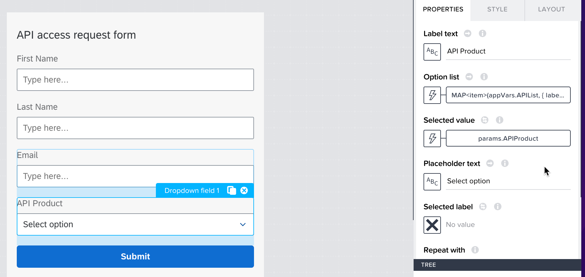
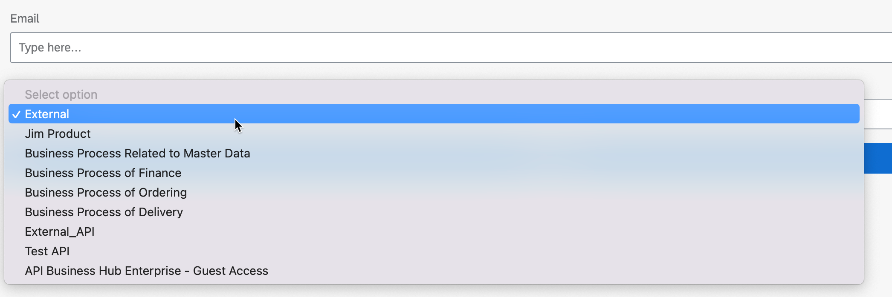
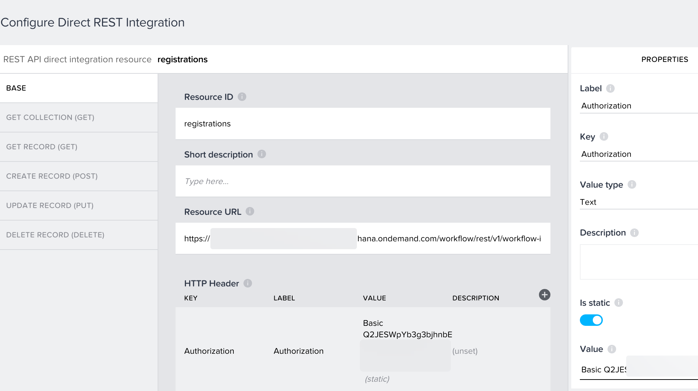
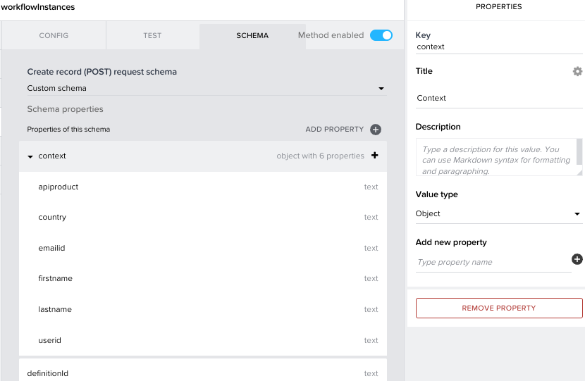
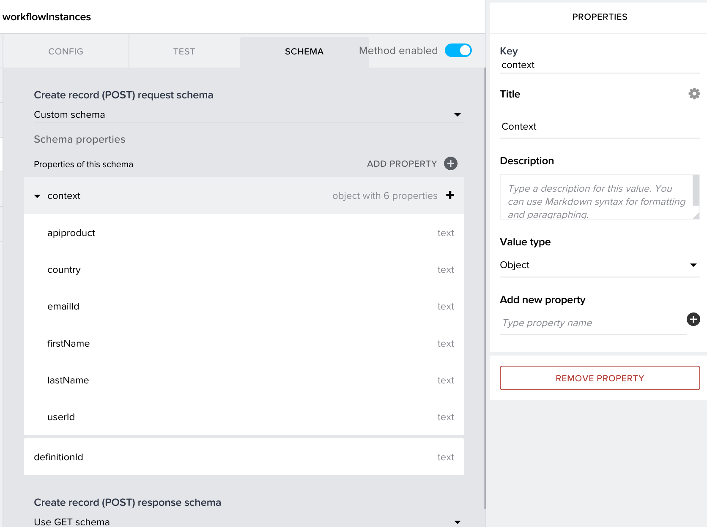
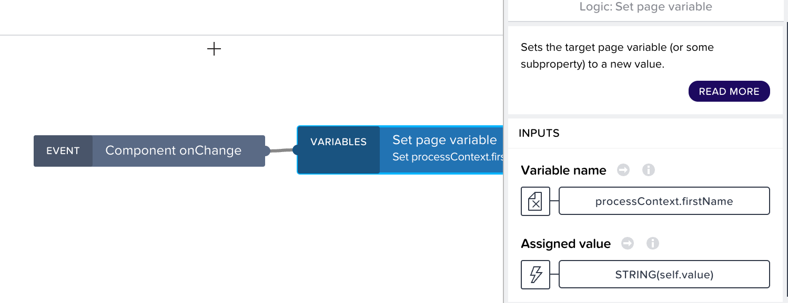
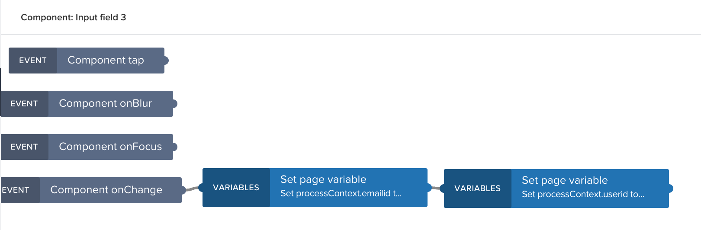
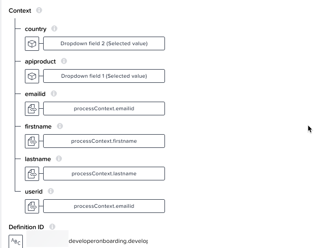
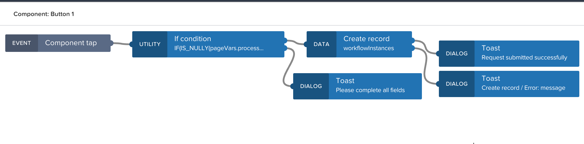

## Integrate the portal and process
Now that your low code portal is built and request API access process deployed, the final step is to integrate the two, so that the process can be invoked from a request form in the portal.
  1. Open the **API Product Detail** page in SAP AppGyver.
  2. Add a button to the bottom of the canvas and set the label to **Request Access to this API**.
  3. Create a new page called **API request form**.
  4. Customize the header and add three input fields below. Name them **First Name**, **Last Name**, and **Email**.
  5. Add a dropdown field component and set the label to **API Product**..
  6. Add a button and name it **Submit**.
  7. Create a page parameter called **APIProduct** (just like the API Product Detail page).
  8. Add logic to the Request access button back on the **API Product Detail** page to open the request form and pass the page parameter. You will implement the logic to populate this value in the subsequent steps.
  9. Create an App Variable called **APIList** as a list of objects with 2 properties.
     

  10. Open the **Home** page, select the basic card list and click **Open in component template editor** to modify the outputs of the component to store the list of API Products during the initial refresh.
     <br><br>[](./img/ComponentEditor.png)

  11. Select **PROPERTIES** and add  a list of objects to output values with 2 properties (save the property key name for later).
     <br><br>[](./img/OutputValues.png)

  12. Return to **VIEW**, select **BASIC CARD LIST 1** from the tree, add a **Set output value** node, and connect it to the output of **Set private data variable**.
     <br><br>[](./img/SetOutputValue.png)

  13. Set the output value to **idDesc** and configure the value as a mapping.
  14. Set the map values to **ID** and **Description**.
     

  15. Exit the editor and save the application.
  16. Add a **Set app variable** node to the Basic card list and connect it to component tap event
  17. Set the assigned value of **APIList** to the selected component value **List of ids and descriptions**
     

  18. Return to **API request form** page and set the option list and selected value properties of the **API Product** dropdown.
      <br><br>[](./img/RequestForm.png)

  19. Use the following formula for the option list:
   ```MAP<item>(appVars.APIList, { label: LOOKUP(item, "title"), value: LOOKUP(item, "id") })```
  20. A preview of the app now shows the dropdown list populated and the selected product highlighted as the default.
      

  21. Add a REST integration under **Data** and point to the API Proxy for the Workflow Instance endpoint. Enable the POST method and add a basic authentication header.
    <br><br>[](./img/RESTprops.png)

  22. Set a custom schema for the POST and enter the input structure from the process.
    <br><br>[](./img/RESTcustomschema.png)

  23. Install the **REST countries** data component from the flow function component market.
  24. Configure the REST entity with a query parameter
      * Key: fields
      * Label: fields
      * Value: name,alpha2Code
  25. Add a data variable to the form page for RestCountries. 
  26. Duplicate the API Product dropdown and rename it to Country.
  27. Set the option list to a mapping, select the data variable for RestCountries, and set the label and value fields to name and alpha2Code respectively.
  28. Set the **selected value** property of the dropdown to No Value.
  29. Add a page variable with type object, name it **processContext**, and repeat the field names for the process inputs.
    <br><br>[](./img/processContextSetup.png)

  30. Set the **Component onChange** event for each input field in the request form to the corresponding named property of the processContext variable. Set the value to a formula ```STRING(self.value)```
    <br><br>[](./img/selfValue.png)

  31. Use the email field for user id as well, so apply two consecutive **Set page variable** nodes attached to each other.
    <br><br>[](./img/emailUserid.png)

  32. Add logic to the submit button, starting with an **If condition**. Set the value to ```IF(IS_NULLY(pageVars.processContext), false, true)```. Note that we really need to check every field to ensure they aren't blank but for simplicity sake we'll check the entire object.
  33. For Output 1, attach a Create Record node and configure the record properties as a custom object, mapping the page parameter values to it. You can retrieve the values from the 2 dropdown menus directly by using **Component Properties > Another component's property or output value** option. Make sure you add the workflow definition id retrieved in the previous section.
    <br><br>[](./img/processContext.png)

  34. For Output 2, attach a Toast dialog and set the message to **Please complete all fields**.
  35. Add an additional toast dialog to the outputs of the **Create record** node to notify of success or failure. Fill out the dialog options:
    
  36. Save the application.
