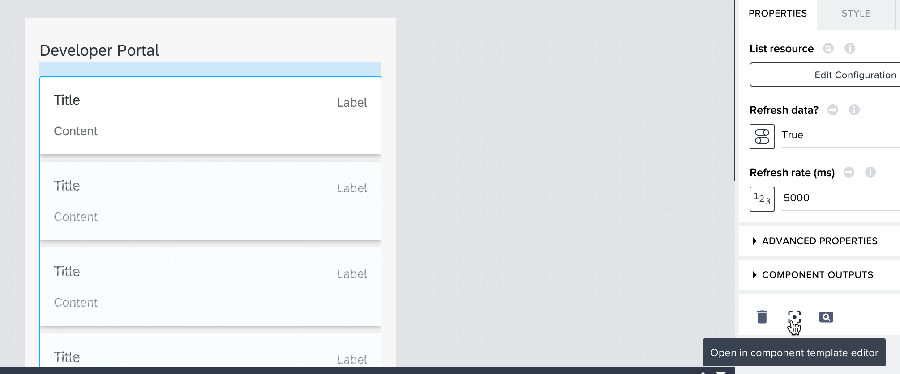
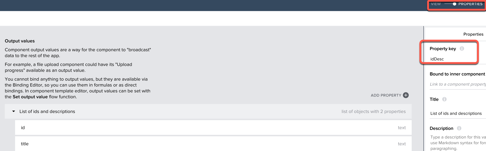
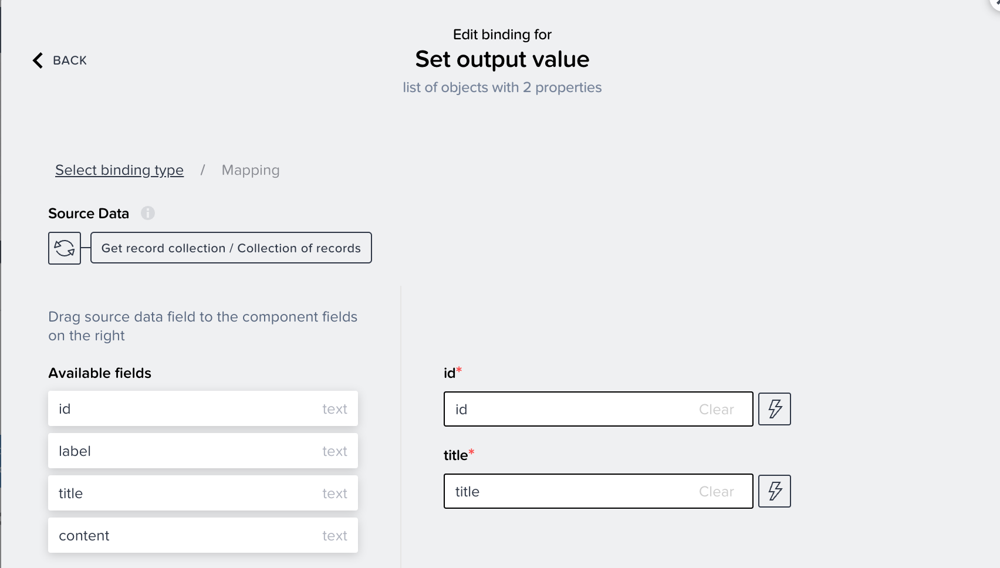
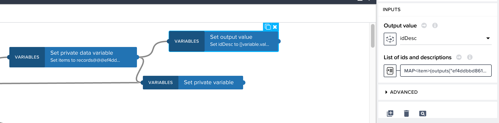
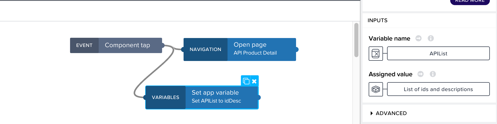

## Integrate the portal and process
Now that your low code portal is built and request API access process deployed, the final step is to integrate the two, so that the process can be invoked from a request form in the portal.
  1. Open the **API Product Detail** page in SAP AppGyver
  2. Add a button to the bottom of the canvas and set the label to **Request Access to this API**
  3. Create a new page called **API request form**
  4. Customize the header and add 3 input fields below. Name them **First Name**, **Last Name**, and **Email**
  5. Add a dropdown field component and set the label to **API Product**
  6. Add a button and name it Submit
  7. Create a page parameter called **APIProduct** (just like the API Product Detail page)
  8. Add logic to the Request access button to open the request form and pass the page parameter
  9. Create an App Variable called **APIList** as a list of object with 2 properties

    

  10. Now we will modify the outputs of the Basic Card list on the Home page to store the list of API Products during the initial refresh

    

  11. Click **PROPERTIES** and add  a list of objects with 2 properties as below

    

  12. Return to **VIEW**, select **BASIC CARD LIST 1** from the tree, add a **Set output value** node, and connect it to the output of **Set private data variable**

    

  13. Set the output value to **idDesc** and configure the value as a mapping, as below

    

  14. Exit and save the application
  15. Add a **Set app variable** node to the Basic card list and connect it to component tap event
  16. Set the assigned value of APIList to the selected component value **List of ids and descriptions**

    

  17. 