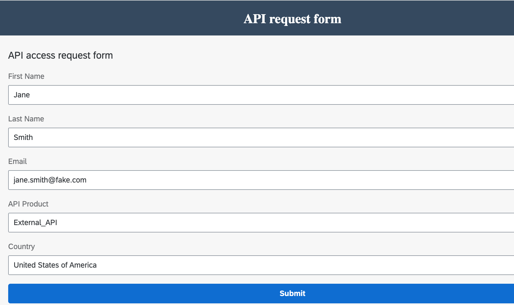
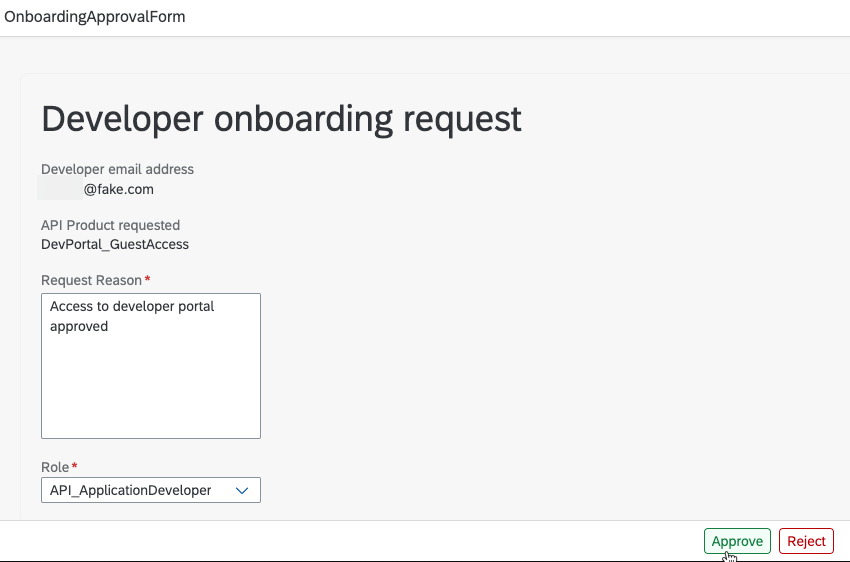
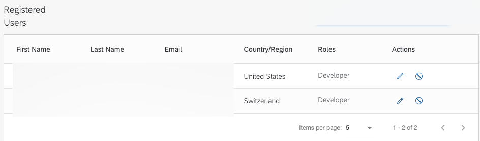

# Test the low code developer portal end to end
As a final step in this mission scope, browse the developer portal as a guest, identify an interesting API Product, and submit an access request. As an administrator, approve that request and have the new developer automatically onboarded to the full SAP API Management, Business Hub Enterprise experience. This section tests all of the integration points between SAP BTP services.
  * Run your developer portal in Preview mode, or [Build and Deploy it to SAP BTP](https://github.com/SAP-samples/btp-s4hana-nocode-extension/blob/main/create-application/deploy/README.md)
  * Navigate from API Product to API Product Details by selecting the **API Business Hub Enterprise - Guest Access** product, or any other one in your environment. If you've already run [Get Started with Integration Suite - API Management](https://discovery-center.cloud.sap/missiondetail/3062/3072/) you should have several more
  * Check out the Swagger documentation for the **Guest Access for Developer Portal** proxy if you completed the optional scope item
  * Click the **Request Access to this API** button
  * Complete the form with some relevant values and click submit
    

  * If any of the requests fail to complete, check the network tab of your Chrome Developer tools for details on the failing request
  * Access the **Application Development Lobby** and select the inbox icon
    

  * Fill out the form and approve the request
    

  * If everything worked, the new user will now be registered in the Business Hub Enterprise under Manage
    

  * If any of the process steps failed, you can find the details under the **Monitor** > **Process and Workflow Instances** section of the Application Development UI
    

Congratulations on completing the Low Code Developer Portal mission scope!