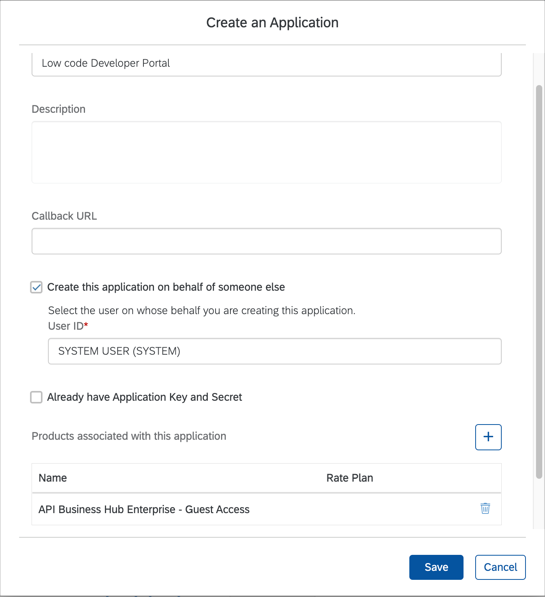
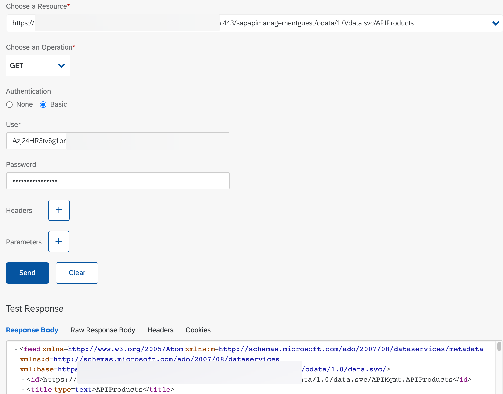

# Low code Developer Portal scope

  1. Prepare platform API proxy
     1. Import zip file
     2. Update Target EndPoint to reflect your env
  2. [Implement SAP Cloud Foundry services policy](https://api.sap.com/policytemplate/SAPCloudFoundryXSUAAJWTToken)
     1. Update ProxyEndpoint > PostFlow > imported policy > setCORS wide open
     2. TargetEndpoint > PreFlow > getcredential > client id and secret
     3. TargetEndpoint > PreFlow getoauthtoken > HTTPTargetConnection > URL to token URL of XSUAA
     4. Scripts > setTarget.js > set targetHost to base of your BHE endpoint (e.g. us20devportal)
  3. Create API Product and associate
     1. Add API proxy from prior step
  4. Register application and generate API Key for service account
     1. Access BHE tenant
     2. My Workspace > Applications > Create

       

     3. Copy Application Key > Test Console
     4. Select Guest Access product
     5. Remove APIMgmt. from resource
     6. Add APIKey header and paste value from previous step and Execute the request

       
       
  5. Build and test AppGyver app
  6. Create API Key request process
  7. Integrate Dev portal with request process via API
  8. Test E2E