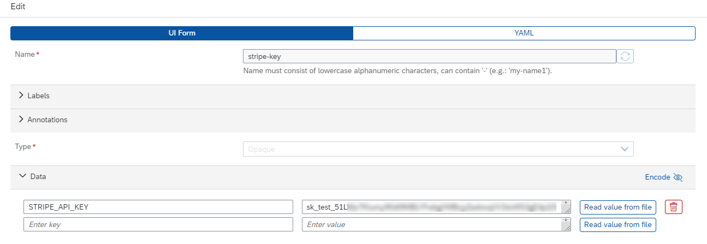

# Deploy Kyma Components

# Prepare the Kyma deployment prerequisites
1. Create a [**Docker Hub**](https://hub.docker.com/) account for yourself if not available yet.
2. Make sure that the latest versions of [**Node.js** and **npm**](https://nodejs.org/en/), [**docker**](https://docs.docker.com/get-docker/), [**helm**](https://helm.sh/docs/intro/install/) and [**kubectl**](https://kubernetes.io/docs/tasks/tools/#kubectl) are installed on your local device and that you can use them from your command line.
3. Install the [**pack tool**](https://buildpacks.io/docs/tools/pack/) to your local device and make sure you can use it from your command line.<br>
  Note: **pack** allows you to simplify the process of creating Docker images without the need of creating a Dockerfile yourself.
4. Checkout the **stripe** branch of the sap-samples [GitHub repository](https://github.com/SAP-samples/btp-create-api-integrations/tree/stripe).
5. Download the **kubeconfig.yaml** file of your Kyma cluster and make sure the KUBECONFIG environment variable is set correctly. See: [Set the KUBECONFIG environment variable](https://kubernetes.io/docs/tasks/access-application-cluster/configure-access-multiple-clusters/#set-the-kubeconfig-environment-variable)
6. In Windows PowerShell the command to set the temporary **KUBECONFIG** environment variable looks like `$ENV:KUBECONFIG="C:\path\to\kubeconfig.yaml"`. Please rember to run that command again whenever you restart your device. For an automated setup you can also store the config file in the ***$HOME/.kube*** directory as described on [kubernetes.io](https://kubernetes.io/docs/concepts/configuration/organize-cluster-access-kubeconfig/). 

>**Important** - Please keep in mind, that in a Trial environment, your Kyma instance will expire after 14 days. To test the solution after 14 days, please delete your Kyma instance, setup a new one and redeploy the solution.

# Add the Stripe API Key as a Kyma secret
### Option 1: Using _kubectl_
Run the following command in your terminal:

```$ kubectl create secret generic stripe-key --from-literal=STRIPE_API_KEY=<stripe-secrect-key> --namespace <namespace>```

Expect the response _secret/stripe-secret created_ but to make sure it's available on the namespace, execute:

```$ kubectl get secrets --namespace <namespace>```

The last entry should be the secret that was just created.
```bash
NAME                                           TYPE                                  DATA   AGE
...                                            ...                                   ...    ...
stripe-key                                     Opaque                                1      11s
```

### Option 2: Via Kyma Dashboard
1. Go to your Kyma target namespace (for example, trial or default) and add a new secret in the **Configuration** section.
2. Name your secret **stripe-key** and add the **Secret Key** of your Stripe Developer portal as a new **Data** value named **STRIPE_API_KEY**.

  


# Deploy the Invoicing Components to Kyma
1. Checkout the **stripe** branch of the sap-samples [GitHub repository](https://github.com/SAP-samples/btp-create-api-integrations/tree/stripe).
2. Change to the **btp-invoicing** directory and install the npm dependencies running the **npm install** command in your terminal.
3. Open the Helm chart **values.yaml** file in the **btp-invoicing/chart/** directory and update the **`<your_docker_account>`** placeholder with your Docker Hub username.
4. If your Kyma target namespace is not named **trial** go to **btp-invoicing/chart/charts/web-application/templates/network-policy.yaml** and update the **kubernetes.io/metadata.name** property accordingly.
5. Ensure you're logged in to Docker Hub by running the **docker login** command in your terminal.
6. Execute the npm command **build-deploy:kyma** with the following parameters

  ```$ npm run build-deploy:kyma --image_name=<your_docker_account>/btp-invoicing --namespace=<namespace>```
  - image_name - Name of the image incl. your docker account like **<your_docker_account>/btp-invoicing**
  - namespace - Name of the Kyma namespace like **trial** or **default** (Kyma namespace needs to be created before deployment)

7. In your terminal window change to the **cron-job** directory.
8. If your target Kyma namespace is not named **trial**, go to **cron-job/deploy-job.yaml** and **cron-job/chart/templates/deployment.yaml**. In both files update the **INVOICING_SERVICE_NAMESPACE** environment variable value accordingly.
9. Execute the npm command **deploy:kyma** with the following parameter

  ```$ npm run deploy:kyma --namespace=<namespace>```
  - namespace - Name of your Kyma namespace like **trial** or **default**
