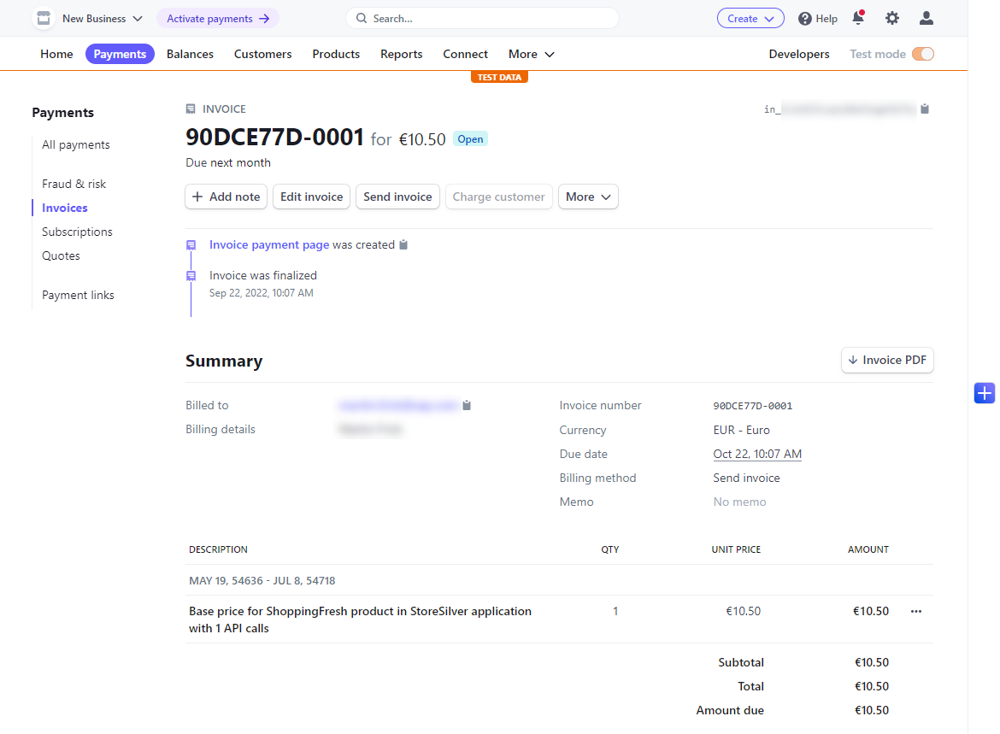
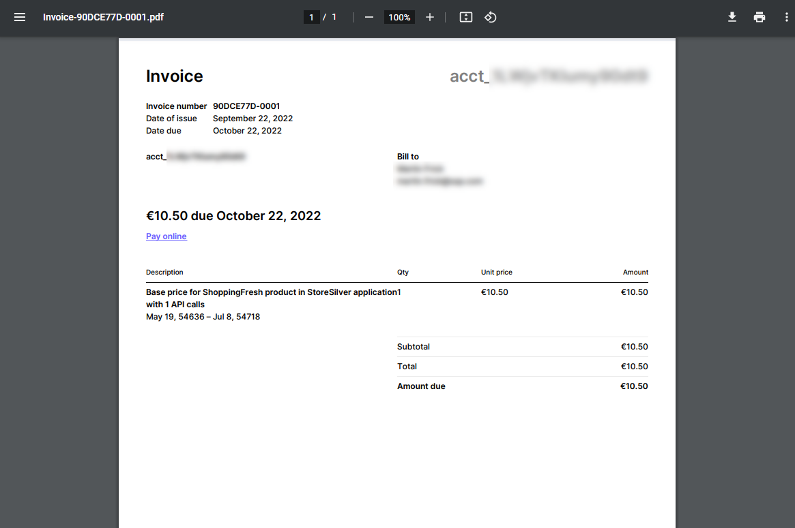

# Test Billing and Invoicing
As a final step in this mission scope, you will test the invoicing flow end-to-end, by manually triggering the respective endpoint of your invoicing service.

> **Note**
> In a regular scenario, this endpoint is called every **second day** of the month by the Kyma Cron job  deployed in the previous part of this mission scope. 

  1. Create a container in your target namespace (for example - trial) based on the latest **curl** image by running the following command in your terminal:
      ```bash
      $ kubectl --namespace=<<namespace>> run curl --image=curlimages/curl -i --tty -- sh
      ```

  2. Run the following command to call the invoicing endpoint of your service instance with a particular month and year which you want to create invoices for:
    > **Note**
    > The CronJob sends an empty body which results in the last month (based on current date) being used as default
      ```bash
      $ curl -X POST 'btp-invoicing-srv.<<namespace>>:8080/invoicing/createStripeInvoices' \
      --header 'Content-Type: application/json' \
      --data-raw '{
          "month": "10",
          "year": "2022"
      }'
      ```
    
  3. The previous command triggers the invoice creation in Stripe and you will see a message similar to the following:
    ```bash
    {"success":true,"message":"1 invoice has been sent successfully to the customer"}
    ```

  4. Check in your Stripe account whether invoices have been created similar to the following (click to enlarge):

      <br>[](./img/STRIPE_Invoice.png)
      <br>[](./img/STRIPE_PdfInvoice.png)

  5. In case you want to re-access the curl container for further tests, please run the following command in your terminal:
    ```bash
    $ kubectl --namespace=<<namespace>> exec -i  --tty curl -- sh 
    ```

Congratulations on completing the API Monetization with Stripe mission scope!
