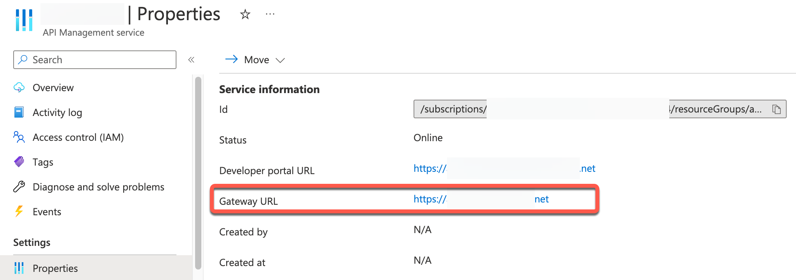
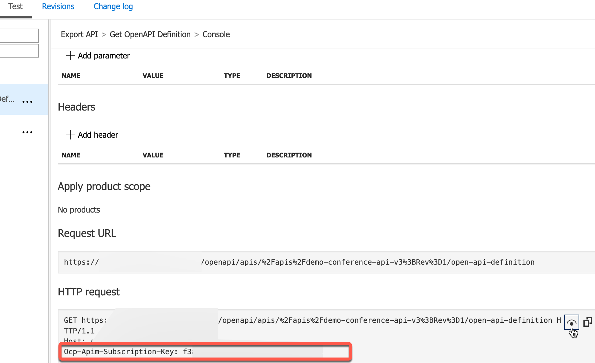

# Create the SAP BTP components needed for API gateway federation

Once you've completed the prerequisites, you will need 2 SAP BTP Destinations available in your subaccount. One of them is used to perform a callback to Azure API Management to retrieve the API documentation and metadata. The other is used to provide access to the SAP API Management underlying platform API, which allows us to create new API Proxies, associate them with an API Product, and update their properties or documentation in case of a new API revision.

1. Access your SAP BTP subaccount and navigate to **Destinations**.
2. If you followed the **API Monetization with Stripe** part of this use case, you will have already created a destination for API Management. If not, complete the [following section](https://github.com/SAP-samples/btp-create-api-integrations/blob/main/01-GettingStartedGuide/01-05-Create-service-instances.md#create-a-service-instance-for-api-portal-api-access) of the getting started guide.
3. Create an additional destination called **azure-dest** and provide the details which will look something like this:
   * Type: HTTP
   * Description: Azure API Management
   * URL: **Gateway URL retrieved from Azure Portal**

      

   * Proxy Type: Internet
   * Authentication: NoAuthentication
   * Additional Properties: URL.headers.Ocp-Apim-Subscription-Key
   * Additional Properties value: **Subscription key retrieved from test console of Azure API Management**

      

4. Access the SAP API Management portal and create an API Product called **Federated_API**