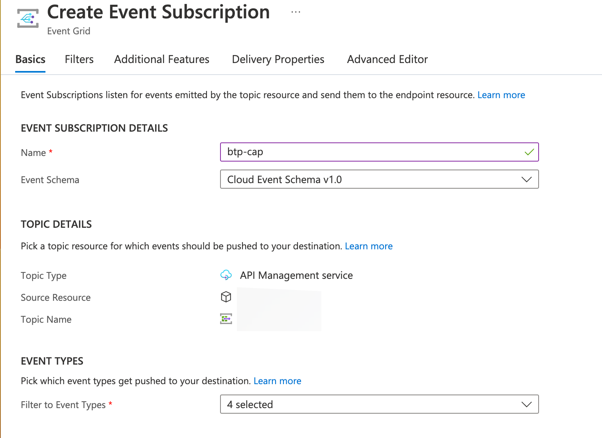

# Deploy Kyma components for API Federation

1. Ensure you have completed the [Kyma deployment prerequisites](../03-APIMonetizationStripe/03-01-Deploy-kyma-components.md#prepare-the-kyma-deployment-prerequisites) from the API Monetization with Stripe use case scope.
2. Checkout the **api-federation** branch of the sap-samples [GitHub repository](https://github.com/SAP-samples/btp-create-api-integrations/tree/api-federation).
3. Open the Helm chart values.yaml file in the **chart** directory and update the <your_docker_account> placeholder with your Docker Hub username.
4. Ensure you're logged in to Docker Hub by running the docker login command in your terminal.
5. Execute the npm command build-deploy:kyma with the following parameters

    ```$ npm run build-deploy:kyma --image_name=<your_docker_account>/api-federation-cap --namespace=<namespace>```

     * image_name - Name of the image, including your docker account like **\<your_docker_account\>/api-federation-cap**
     * namespace - Name of the Kyma namespace like **trial** or **default** (Kyma namespace needs to be created before deployment)

# Create event subscription between Azure Event Grid and SAP BTP, Kyma runtime webhook

1. Create an [event subscription using Cloud event schema](https://docs.microsoft.com/en-us/azure/event-grid/event-schema-api-management?tabs=cloud-event-schema) for events such as **Microsoft.ApiManagement.APIUpdated**, **Microsoft.ApiManagement.APIReleaseCreated** and **Microsoft.ApiManagement.APICreated**

  [](./img/create_event_subscription.png)

2. Set the Endpoint Type to **Web Hook** and set the Endpoint value to the **/apiReceiver/NewApi** path of the CAP application, for example: https://api-federation-cap-srv-api-federation.\<kyma cluster\>/apiReceiver/NewApi
3. Confirm the selection. You can check the logs of the deployed pod in Kyma (Pods > api-federation-cap-srv > Containers > View Logs) and you should see the handshake process complete: 

  ```Callback address: https://rp-eastus.eventgrid.azure.net:553/eventsubscriptions/btp-cap/validate?id=\<ID\>=2023-01-09T18:39:37.5594330Z&apiVersion=2021-10-15-preview&token=\<token\>```<br>
  ```handshake complete```