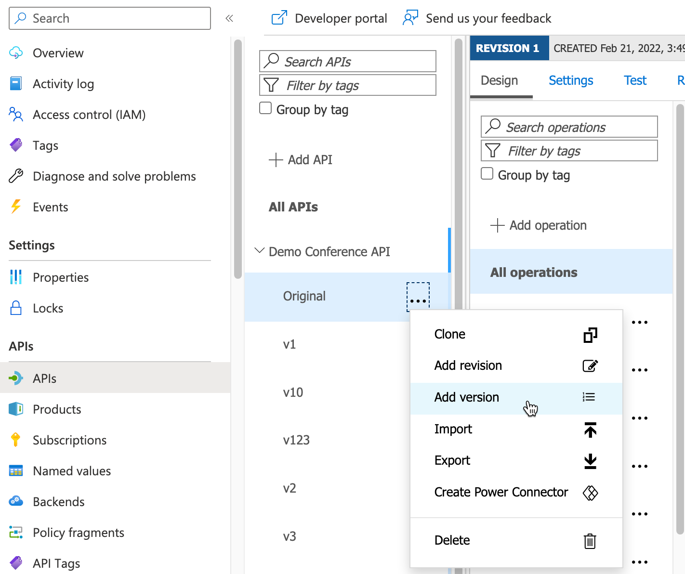
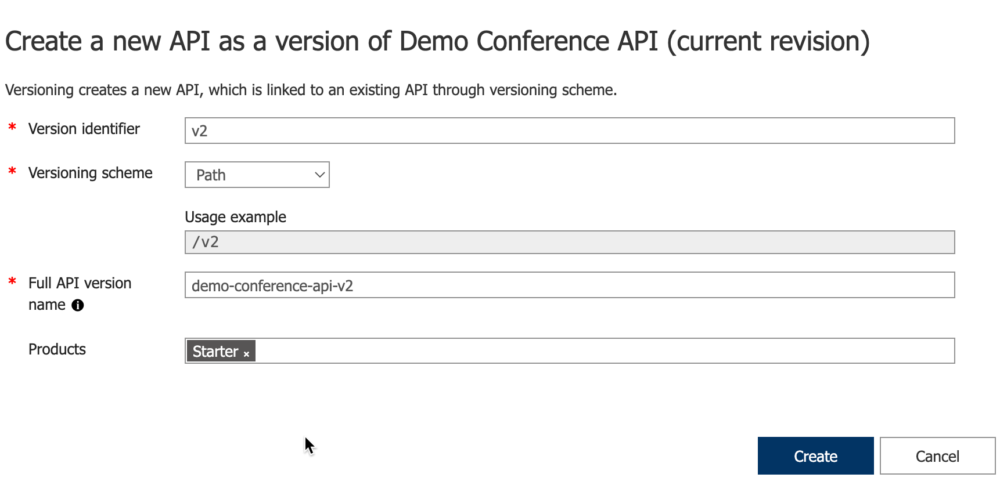
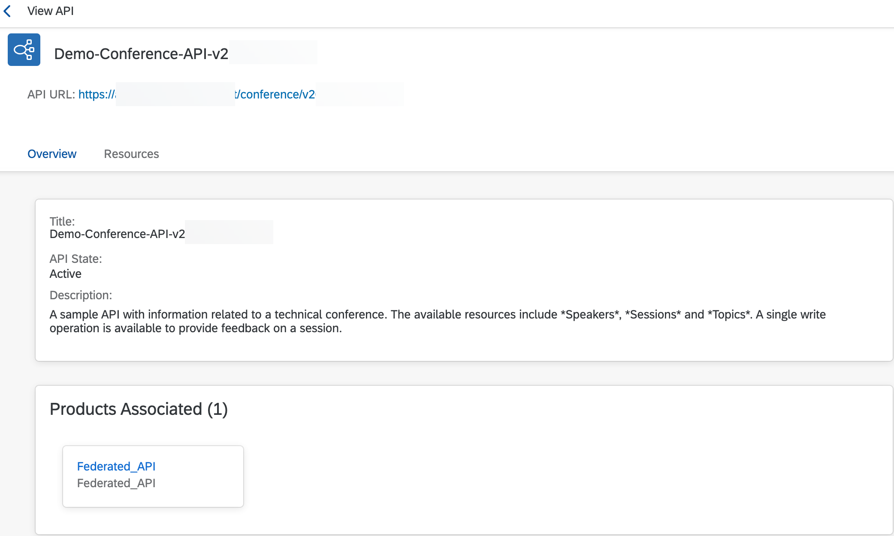
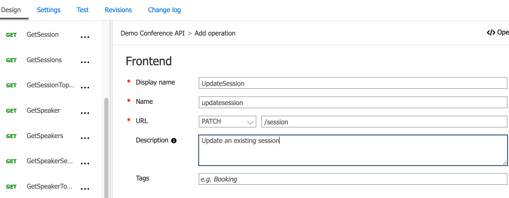
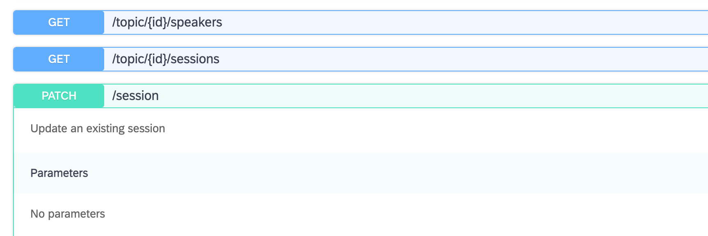

# Test API federation capability end to end

Now that you have deployed the components and configured an event subscription, you can test the API Federation capability by creating API artifacts in your Azure API Management instance. The sample application supports 2 scenarios out of the box, creation of a new remotely managed API, and updating an existing one, for example by adding a new method/verb. Additional scenarios, such as deleting an API could also be implemented.

1. In your Azure API Management instance, select **APIs** and locate the Demo Conference API that is installed by default. Click the ellipse and select **Add version**.

  [](./img/create_api.png)

2. Fill the version identifier and add it to the end of the Full API version name field as well. Associate it with a product and click Create.

  [](./img/create_version.png)

3. The Kyma container logs should show the following message if creation was successful:

  ```[cds] - POST /apiReceiver/NewApi```<br>
  ```Result of proxy creation: batch request was successful with status code 202```

4. Check the develop menu of the SAP API Management API Portal to see the new proxy has been created, associated with the Federated_API product, and contains updated documentation.

  [](./img/api_portal_new.png)

5. Return to Azure API Management, select the newly created API version, and click **Add operation**
6. Input the necessary details, providing a display name, a method, and a URL. Save the changes. For example:
  * Display Name: UpdateSession
  * URL (Method): PATCH
  * URL (Path): /session
  * Description: Update an existing session

  [](./img/update_api.png)

7. Click the ellipse next to your API version and select **Add revision**. Provide a note and click **Create**.
8. The Kyma container logs should show the following message if the update was successful:

  ```[cds] - POST /apiReceiver/NewApi```<br>
  ```Result of update proxy: batch request was successful with status code 202```

9. Check the resources section of the API Proxy in SAP API Management to see the changes:

  [](./img/updated_docs.png)

Congratulations on completing the API Federation use case scope!