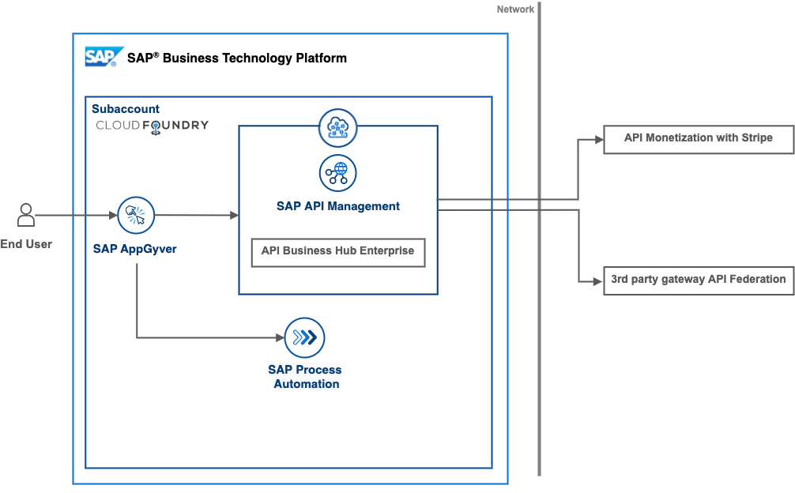

# Create simple, connected digital experiences with API-based integration
<!-- Please include descriptive title -->

<!--- Register repository https://api.reuse.software/register, then add REUSE badge:

-->

## Description
Realize a unified catalog and developer portal for all API, wherever they’re managed. Build your own digital experiences with SAP low code solutions, SAP Integration Suite, and SAP BTP, Kyma runtime to operationalize access requests, federate API from disparate gateways, and monetize their use.

In an API-first economy, the new business opportunities created from transactional and analytical systems are invaluable. Ensure governance, agility, and a clean line of sight into consumption help you make the most of them.

## Challenge
While consumption of API is a standard function of software development, API providers face a number of unique challenges. These include securing access to sensitive data in cloud and on-premise systems, managing API across a heterogenous landscape, and creating revenue opportunities from internal and external usage.

## Solution
A single point of access to all API for all developers, powered by workflows and event-based integration with third party API management. This unified catalog consists of a tailored UX, an API key approval process, and automated billing based on rate plans.

## Outcome
An empowered developer ecosystem with self-service access to API, supported by secure digital processes. Reference architectures for federation of remotely managed API, customized developer portal, and billing and invoicing of rate plans with [Stripe](https://stripe.com/).

## Requirements
You can find the detailed pre-requisites for running each part of this mission in the [Getting started guide](./01-GettingStartedGuide/README.md)

## Download and Installation
- Artifacts needed for the low-code developer portal scenario can be found in a [dedicated branch](https://github.com/SAP-samples/btp-create-api-integrations/tree/low-code-dev-portal)

## Known Issues
- API bills can only be read for completed months, not current month

## How to obtain support
[Create an issue](https://github.com/SAP-samples/btp-create-api-integrations/issues) in this repository if you find a bug or have questions about the content.
 
For additional support, [ask a question in SAP Community](https://answers.sap.com/questions/ask.html).

## Contributing
If you wish to contribute code, offer fixes or improvements, please send a pull request. Due to legal reasons, contributors will be asked to accept a DCO when they create the first pull request to this project. This happens in an automated fashion during the submission process. SAP uses [the standard DCO text of the Linux Foundation](https://developercertificate.org/).

## License
Copyright (c) 2022 SAP SE or an SAP affiliate company. All rights reserved. This project is licensed under the Apache Software License, version 2.0 except as noted otherwise in the [LICENSE](LICENSE) file.
